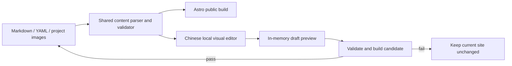

# Yunxi Wu 学术个人网站：内容重写与可视化本地编辑器设计规格

**日期：** 2026-08-12

**状态：** 已批准的重设计；等待用户对本书面规格作最终复核

**公开网站语言：** 英文为主

**本地编辑器语言：** 中文

## 1. 权威性与取代关系

本规格完整取代 2026-08-11 的两份网站设计规格、2026-08-11 的实施计划，以及基于这些文档形成的旧验收记录。若旧文档、当前实现、现有测试或现有图片与本规格冲突，以本规格为准。

旧实现、旧测试、旧图片和旧验收记录仅作为历史基线，不再是需求或验收依据。已经从原始报告、模型和代码中核实过的事实，只有在重新满足本规格的真实性、归属、隐私和图片规则后才可复用。后续必须另写一份新实施计划，并产生一份新的本地验收记录；旧实施计划不得继续执行。

本次批准仅授权在本机网站项目内进行设计和后续经批准的实施，不授权创建远程仓库、推送、启用 GitHub Pages 或公开部署。

## 2. 目标与成功标准

重设计同时解决两个问题：

1. 把当前泛泛而谈、项目归属不清、图片质量不足的项目页，改成适合硕士或博士项目申请阅读的证据型学术作品集。
2. 提供一个直观的中文本地编辑器，使非技术用户能够直接修改公开文字、项目、图片、头像、联系方式和视觉设置，同时继续保留手工编辑 Markdown 与配置文件的能力。

成功版本必须做到：

- 访客能在项目页开头迅速理解问题、方法和最强证据，而不是先读空泛的 `Overview`。
- 个人项目绝不出现 Contribution；团队项目明确区分个人职责与团队整体成果。
- 项目叙述中的数字、归属和限制均可追溯到原始材料，不夸大为硬件实现、真实部署或实验验证。
- 所有公开图片清晰、相关、无报告图号或图注、无页眉页脚和私密信息。
- 用户可以通过真正的可视化界面完成常见编辑，也可以直接修改容易理解的 Markdown/YAML 文件。
- 保存、恢复、冲突处理和图片导入不会损坏现有可用网站，也不会改动原始课程资料或网站项目之外的文件。

## 3. 明确不做的内容

本轮不包括：

- 公开在线 CMS、账号系统、数据库或云端编辑器；
- 公开网站中的中英文切换；
- 图片裁剪、缩放、滤镜或复杂图像编辑；
- 自动生成或改写项目技术事实；
- 自动推送、自动公开发布或自动修改 GitHub 仓库设置；
- CV 下载入口；
- 修改 OneDrive 中的 PDF、Word、SLX、MATLAB 或原始图片；
- 静默安装系统级软件、请求管理员权限或修改系统 `PATH`。

## 4. 总体架构

系统由三个相互分离的部分组成：

1. **公开静态网站**：继续由 Astro 构建，可部署到 GitHub Pages；最终输出不含编辑器代码、编辑标记、备份或本地 API 地址。
2. **唯一内容源**：公开资料由 Markdown、YAML 配置和项目专用图片组成。手工编辑和可视化编辑器读写同一套文件，不建立第二个数据库。
3. **仅本机运行的中文编辑器**：由 `启动网站编辑器.bat` 启动，只监听回环地址，提供真实网页预览、侧栏表单、内容块排序、图片替换、验证、备份和恢复。



编辑器源码可以保存在 Git 仓库中以便维护，但公开构建必须从入口和产物层面排除编辑器。备份、运行令牌、候选构建和本地工具目录必须同时被 Git 和公开构建排除。

## 5. 唯一内容源与磁盘结构

目标结构如下；实施计划可以调整目录名，但不得改变其职责边界：

```text
src/content/
  site.yml
  site-images/
    avatar.png               # 可选的网站专用副本
  pages/
    about.md
  research/
    <record>.md
  projects/
    <stable-slug>/
      index.md
      images/
        <sanitised-name>.png
editor/
  server/
  client/
.local-editor/               # Git 忽略，仅本机
  backups/
  runtime/
  tools/
```

### 5.1 全站配置

`site.yml` 是全站公开资料和外观设置的唯一配置源，至少覆盖：

- 姓名、学位、专业方向、学校、简介和研究兴趣；
- 公开邮箱；
- GitHub、LinkedIn、Google Scholar、ORCID 和自定义链接；
- 头像模式：图片、姓名首字母或隐藏；
- 背景色、表面色、文字色和强调色；
- 导航中启用的页面。

所有非必填字段均可留空。留空、隐藏或空数组不会渲染占位文字、空图标、空链接或额外空白。链接可新增、删除、隐藏和排序。公开网站的大多数正文固定以 Times New Roman 为主，标题和界面辅助文字使用兼容的克制字体组合；本轮不增加任意字体选择器。

主题是在生成静态网站时确定的，不增加公开页面中的主题切换器。手工输入颜色在保存前必须通过文字、链接和键盘焦点的对比度检查；不合格设置会阻止保存并给出中文修正提示。

### 5.2 项目文件

每个项目使用稳定 `slug` 对应一个文件夹。`index.md` 的 YAML frontmatter 保存结构化元数据，Markdown 正文保存有顺序的项目章节。

结构化元数据至少包括：

- `kind`: `individual` 或 `team`；
- `category`: 可编辑的公开标签，例如 `Individual detailed-design project`、`Individual laboratory project` 或 `Team systems-design project`；
- `title`、`shortTitle`、`summary`、`role`；
- `methods`、`featured`、`order`；
- 可选日期和项目状态；
- 章节可见性与编辑器需要的稳定标识。

`kind` 决定归属规则，`category` 只决定访客看到的标签，二者不得混为一谈。

### 5.3 Markdown 可逆子集

编辑器必须支持并可无损往返以下内容：

- 二级标题作为顶层章节；
- 三级标题作为章节内部的小标题；
- 段落、粗体、斜体和链接；
- 有序列表和无序列表；
- 标准 Markdown 表格作为“关键数据”块；
- 图片、替代文本和紧随其后的独立图片说明；
- 编辑器生成的不可见稳定标识与可见性注释。

公开标题层级固定为一个 `h1`，正文顶层章节为 `h2`，其内部标题为 `h3`，不得跳级。

编辑器标记采用手工可读的 HTML 注释并紧邻所描述的内容，例如：

```markdown
<!-- editor:section id="stable-id" kind="standard" hidden="false" -->
## Engineering Challenge

<!-- editor:block id="stable-id" type="paragraph" hidden="false" -->
Life-support demand changes with the physical state of the system.
```

团队贡献章节使用 `kind="contribution"`，而不是靠标题文本猜测语义。手工新增、尚无标记的受支持 Markdown 内容会在编辑器内获得新标识，并仅在下一次成功保存时写入。标识不得用作公开 URL 或显示给访客。

图片在 Markdown 中必须保持可手工理解的形式：标准图片语法承载文件和 alt，紧随的斜体 `Caption:` 段落承载网页图注。编辑器把二者视为同一个可拖动图片块；网页把它渲染为 `figure` 与 `figcaption`。网页图注不以 `Fig.` 开头，也不复用报告编号。

若手工 Markdown 包含编辑器尚不支持的语法，编辑器必须把对应范围标为“高级 Markdown 块”并保留原始字节，不得先解析后以有损格式重写。无法证明可逆时，保存会被阻止，用户可切换到源码视图手工处理。

“隐藏”只是不在生成网页中展示。隐藏内容仍保存在 Markdown，并可能在未来的公开源码仓库中被看到；编辑器必须在隐藏操作旁明确提示这一点。私密内容不得依赖隐藏功能保护，应从规范内容中移除并只留在本机备份中。

## 6. 个人项目与团队项目规则

### 6.1 个人项目

个人项目：

- 数据中不得存在 contribution 语义章节；
- 编辑器不得生成 Contribution 输入项；
- 公开 DOM 中不得出现 Contribution 标题、空容器或隐藏占位；
- 可使用 `Role` 表明个人设计、建模或实验室工作，但不写团队贡献式措辞。

新建个人项目时，默认建议章节为：

1. Engineering Challenge 或 System Model
2. System Architecture / Method
3. Control or Optimisation Strategy
4. Simulation or Experimental Evidence
5. Limitations and Next Steps
6. Selected Technical Evidence

这些是可编辑模板，不要求所有个人项目使用完全相同的名称。

### 6.2 团队项目

团队项目必须恰好包含一个非空的 `My Role and Contribution` 语义章节。该章节可以调整顺序和编辑内容，但在项目仍为团队类型时不可隐藏、删除或改名；公开标题固定为 `My Role and Contribution`。

团队项目必须在内容上分别说明：

- 个人的协调、领导、建模或设计职责；
- 团队共同完成的系统或报告成果；
- 不应归属于个人的其他团队工作。

新建团队项目时，默认建议章节为：

1. Design Context
2. My Role and Contribution
3. Technical Highlights
4. Outcomes and Limits
5. Selected Technical Evidence

### 6.3 类型转换

- 从个人改为团队时，编辑器插入空的必需贡献章节，并在填写前阻止发布保存。
- 从团队改为个人时，编辑器先显示将被移除的贡献章节及差异；用户二次确认后，该章节只从新版本中移除，旧内容仍可从备份恢复。
- 不能通过自定义标题或隐藏标记绕过上述归属规则。

### 6.4 内部工作包术语

公开网站、可视化预览和公开内容文件必须使用完整系统名称，不要求访客理解内部工作包缩写。历史规格可以保留为不参与网站构建的设计记录，但未来若源码仓库公开，它们仍可能被仓库访问者看到。历史记录不得作为公开文案来源；新内容与生成结果需要自动检查是否重新引入这些内部代号。

## 7. 可视化编辑器体验

### 7.1 启动与关闭

- 双击 `启动网站编辑器.bat` 后，启动本地服务并自动打开浏览器。
- 启动窗口用中文显示状态、访问地址和停止说明。
- 关闭启动窗口会停止编辑器及其子进程，不遗留后台服务。
- 若默认端口被占用，编辑器安全选择可用本地端口；无法启动时显示中文原因。
- 启动器不得静默下载系统软件、请求管理员权限或修改 `PATH`。

### 7.2 主界面

左侧导航包括：

- 全站资料
- 首页
- 研究与稿件
- 项目
- 外观
- 备份

中央区域显示接近最终网站的真实预览。右侧检查器显示当前选中内容的中文字段。点击预览中的姓名、简介、联系方式、标题、段落、列表、关键数据或图片，会定位到对应字段；字段改变后，内存草稿立即更新预览。

预览提供桌面、平板和手机宽度切换。它使用与公开页面相同的内容解释和主要样式，不另造一套视觉模板。

### 7.3 内容块操作

项目页支持：

- 新增、复制、隐藏、删除和拖动章节；
- 修改非受保护章节的名称；
- 新增、编辑、复制、隐藏、删除和拖动段落、列表、关键数据与图片块；
- 创建项目时选择个人或团队模板；
- 修改项目类型时执行第 6.3 节的归属保护；
- 通过键盘按钮完成与拖动等价的上移、下移操作。

“删除”在草稿阶段只改变内存；保存后旧版本仍存在于编辑器备份中，不会改动原始课程资料。

除项目外，编辑器还必须完整覆盖已批准的公开内容：

- 全站资料与外观：编辑 `site.yml` 中的姓名、教育信息、简介、兴趣、公开联系方式、社交链接、头像模式和颜色；
- 首页与 About：编辑相应 Markdown 页面；
- 研究与稿件：新增、编辑、排序、隐藏和删除研究记录，并编辑标题、作者身份、公开状态、摘要和范围；
- 当前稿件的状态字段受证据规则保护，除非用户提供新的编辑部证据，否则不能从已核实状态改成更进一步的出版状态。

### 7.4 保存方式

编辑器不自动保存。离开或刷新含未保存草稿的页面前必须警告。只有点击“保存并生成网站”才触发磁盘写入流程。

## 8. 图片导入与展示

编辑器提供简单图片管理，不提供裁剪或缩放：

- 从浏览器选择本地图片；
- 预览、替换、隐藏、删除和排序；
- 编辑英文 caption 和 alt；
- 保存时复制为网站专用副本，不移动或修改来源文件；
- 解码并重新编码为无个人或来源元数据的网站格式，保持可见像素分辨率；带 EXIF orientation 的图片先把方向落实到像素，再清除该元数据；
- 规范化文件名并安全处理同名冲突；
- 拒绝无法安全解码、动画、超出限制或不受支持的文件。

头像图片使用同一导入管线和安全规则，保存到 `site-images/`；隐藏或替换头像不会修改原头像文件。

项目 Markdown 以相对路径引用同项目的图片，例如 `./images/result.png`。构建系统负责把它解析为兼容 GitHub Pages 基础路径的公开资源；编辑器不得把本机绝对路径写入 Markdown 或生成页面。

首版至少支持 PNG、JPEG、WebP 和 TIFF 的导入；网站专用副本使用经过验证的无元数据格式。具体解码库版本在实施计划中锁定并测试，但不得依赖系统级图片软件。

编辑器不能可靠判断图片像素中是否烘焙了 `Fig.`、报告图注或身份信息，因此保存前显示醒目的人工检查提示。初始三项目图片由实施阶段逐张按原始尺寸检查；自动元数据扫描只是补充，不能替代视觉检查。

未来新增项目允许没有图片；无图片时整个证据画廊不渲染。初始三项目的图片数量由内容质量决定，不把“全站恰好若干张图片”作为永久测试条件。

## 9. 事务式保存、备份与冲突处理

### 9.1 保存事务

点击保存后按以下顺序执行：

1. 在内存中检查 schema、归属规则、Markdown、链接、颜色和图片。
2. 重新计算全部相关文件哈希，检查是否被编辑器外部修改。
3. 在 `.local-editor/backups/<operation-id>/` 创建本次操作记录，保存当前规范内容的完整可恢复副本。
4. 在同一操作记录内创建候选内容和候选构建；候选构建使用可切换的内容根目录，不先改写正式内容。
5. 对候选网站运行内容、隐私、路由、图片和构建检查。
6. 全部通过后，以带恢复日志的目录级替换提升候选内容和候选输出。
7. 写入成功清单、哈希和时间；失败则保留当前正式内容与上一个可用输出字节不变。

Windows 上的多目录提升不宣称为单条文件系统原子指令。编辑器必须写入恢复日志，并在启动时检测未完成事务；若上次进程异常中断，应自动恢复到明确的前一完整状态或阻止继续并给出中文恢复指引。

候选文件、构建日志和失败记录都存放在本次编辑器备份操作目录中，不在电脑其他位置散落持久临时文件。

### 9.2 备份规则

- 备份完整包含配置、Markdown、项目专用图片、清单和必要的恢复信息。
- 每次成功保存或恢复都创建新备份；进入候选构建后失败的操作也保留为可诊断记录。
- 最多保留最近 20 个编辑器操作备份。
- 只有编辑器自己在 `.local-editor/backups/` 中创建且通过清单验证的第 21 份及更旧备份可以自动硬删除。
- 不删除、移动或覆盖网站项目之外的任何本地文件。
- 恢复前先显示文字、配置和图片差异并要求确认；恢复本身先创建一份 pre-restore 备份，并计入 20 份规则。

### 9.3 外部修改冲突

编辑器载入时记录内容哈希，而非只看修改时间。保存前若配置、Markdown、caption、alt 或图片发生外部修改：

- 禁止静默覆盖；
- 显示磁盘版本与草稿差异；
- 允许重新载入磁盘版本；
- 允许把当前草稿另存进编辑器备份，保持规范内容不变；
- 只有在用户明确选择、查看差异并二次确认后，才能先备份外部版本再以草稿覆盖。

## 10. 本地安全与软件边界

- 编辑器只绑定 `127.0.0.1` 或等价 IPv6 回环地址，不绑定 `0.0.0.0`、局域网或公网地址。
- 启动时产生随机会话令牌，并检查 Host、Origin 和写操作令牌；不提供无需令牌的文件写入 API。
- 文件 API 只允许访问规范化后的白名单内容目录，拒绝绝对路径、`..`、编码穿越及通过符号链接或 junction 逃逸项目根目录。
- 图片通过浏览器上传字节，服务端不接受任意外部文件路径。
- 编辑器无遥测；正常编辑与预览不向第三方发送内容。
- 所有自动化测试只能使用项目内测试夹具和编辑器自己的临时/备份目录。

若缺少运行软件：

- 优先使用项目内部、无需管理员权限且不修改 `PATH` 的工具；
- 可在网站项目的 Git 忽略工具目录中安装经过来源和哈希验证的便携运行环境；
- 任何系统级安装、管理员权限或系统环境变量修改，仍必须另行说明软件名称、来源、位置与影响，并再次取得用户许可；
- 安装与启动脚本不得改动 OneDrive 原始资料或其他本地文件。

## 11. 初始三项目内容重写

所有公开正文以英文写作。风格是强力精简的研究生申请型技术叙述：每段只表达一个工程观点，开头先说明问题、方法与最强证据；不使用泛泛的课程总结。

### 11.1 Multi-Domain Life-Support Power and Control Simulation

**归属：** Individual detailed-design project

**角色：** Designer and modeller of the individually submitted detailed design

**边界：** 该详细设计位于更大的团队海洋栖息地概念之内；此页面只把生命保障详细设计、模型和报告归于个人。

**短摘要：**

> An individual Simulink/Simscape design coupling power conversion with water, atmospheric-gas, thermal and humidity regulation for a future ocean habitat.

**首版目标叙事结构：**

1. Engineering Challenge
2. Coupled System Architecture
3. Control Strategy
4. Simulation Evidence
5. Model Limitations and Next Steps
6. Selected Technical Evidence

**必须表达的核心：**

- 生命保障负载不是固定电阻；泵、电解、通风和热管理随水量与舱内状态切换。
- 模型把受扰动的 690 V 三相供电，经 DC link、保护/滤波和功率变换连接到受控 180 V 配电母线。
- 电气网络与水 intake、海水淡化、回收和分配，氧气生成、二氧化碳去除，以及湿空气 HVAC 和除湿过程耦合。
- 上层根据氧气、二氧化碳、水位、温度和露点反馈产生使能与设定值；下层用前馈、PI、滤波和 PWM 调节母线及部分下游负载。
- 跨电气、旋转机械、热湿、气体浓度和水量域的闭环联合建模是该项目最重要的亮点。

**可以公开的结果表述：**

- 在报告给出的扰动和负载切换序列中，仿真 180 V 母线保持接近参考值。
- 报告曲线显示水箱位于 600–1200 L 切换范围、制水能力约 1200 L/day、氧气位于 20.5–21.5%、二氧化碳约 400 ppm、温度位于给定 15–30 °C 范围、露点低于 12 °C。
- 累计输入输出能量比在该模型配置中达到约 97.6%。必须紧邻说明：这是提交模型的仿真比值，不是测得的物理系统或变换器效率；部分平均值功率模块采用理想化效率设置。

**限制与下一步：**

- 使用额定点和经验化模型；尚未采用完整厂商特性图。
- 尚未加入高保真 SWRO/HVAC 过程、完整热端口、老化和故障场景。
- 没有硬件、实验或现场验证。

**初始图片：**

1. 180 V 母线前馈与 PI 调节结构图，只保留框图，不含报告图号或图注。
2. 氧气、二氧化碳、舱温和露点的综合仿真结果面板，只保留曲线区域。
3. 可选：制水率与 600–1200 L 水位控制曲线；只有在网页尺度清晰时使用。

现有过密 HVAC 截图和带报告图号的效率截图不复用。

### 11.2 Communication-System Modelling and Filter Optimisation

**归属：** Individual laboratory project

**角色边界：** 提交包支持将其描述为个人实验室项目，但不使用缺乏明文证据的“sole author”措辞。

**短摘要：**

> Built a reproducible MATLAB study connecting thermal-noise theory, distance-dependent attenuation and coherent OOK demodulation with a controlled comparison of four filtering methods under AWGN.

**首版目标叙事结构：**

1. System Model
2. Filter-Optimisation Pipeline
3. Results and Engineering Interpretation
4. Validation and Limitations
5. Selected Technical Evidence

**必须表达的核心：**

- 先分析温度和带宽对 Shannon capacity 与相干二进制误码概率的影响，再分析 2 dB/km 条件下 20 km 链路的 SNR 衰减。
- 在相干 OOK/AWGN 接收机中，对 moving median、FFT、四阶 Butterworth 与四阶 Chebyshev 进行逐噪声水平的参数搜索。
- 使用固定随机种子；在每个 bit 中心采样，并使用解析阈值 0.25 作判决。
- median window 以 BER 最小为主、MSE 为同 BER 时的判据；FFT 与 IIR cutoff 搜索采用第一个取得最小 BER 的候选。最终滤波器推荐按平均 BER 排序，平均 MSE 仅在平均 BER 相同后比较。

**可以公开的结果表述：**

- 在最接近 290 K 的模型采样点，0.5、1 和 2 GHz 带宽对应的仿真容量约为 2.835、4.698 和 7.504 Gb/s。
- 2 dB/km 模型中，SNR 从 0 km 的约 103.86 dB 降至 20 km 的约 63.86 dB，与 40 dB 总路径损失一致。
- 在九个测试噪声幅度及各自选定参数的这一次确定性仿真中，Butterworth 的报告平均 BER 为 0.0593、平均 MSE 为 4.04 × 10⁻²；不得扩展为统计显著或普遍性能结论。

**限制与下一步：**

- 消息只有 15 bit，单一噪声条件的 BER 分辨率为 1/15；九个条件平均值的步长为 1/135。
- 每个噪声幅度只有一个固定种子实现，且调参和评价使用同一组仿真信号。
- `filtfilt`、已知噪声水平和固定阈值限制了直接实时实现解释。
- Excel 与闭式计算是实现交叉检查，不是独立预测验证。

**初始图片：**

1. 从原始 `MSE BER` 高分辨率资产转换的干净 MSE/BER 双面板图。
2. 从原始窗口敏感性资产转换的 median-window 选择与边缘保持权衡图。
3. 处理流程只在能精简成网页尺度可读的小图时作为可选第三图。

现有带报告 `Fig.` 的 capacity 截图、带 `Table.` 和正文的结果截图不复用。

### 11.3 Future Ocean Habitat — Integrated Systems Concept Design

**归属：** Team systems-design project

**角色：** Group Coordinator; lead for the Energy System, Communication, Monitoring and Control Systems, and Underwater Data Centre


**首版 My Role and Contribution 文案：**

> As group coordinator, I led the Energy System, Communication, Monitoring and Control Systems, and Underwater Data Centre workstreams. I also contributed to mission definition, site and operating requirements, and structural integration, with responsibility for aligning electrical, thermal, information and safety interfaces across the overall concept.

**首版目标叙事结构：**

1. Design Context
2. My Role and Contribution
3. Technical Highlights
4. Outcomes and Limits
5. Selected Technical Evidence

**优先技术亮点：**

- 耦合 OTEC 固定点模型闭合 gross generation、海水流量、管损、泵功率和辅助负载：约 2.298 MW gross 对应 1.500 MW net 设计目标，含约 0.729 MW pumping 与 0.069 MW auxiliary，并在报告模型中 11 次迭代收敛。
- 6.6 kV 双母线、690 V 本地配电、N-1 供电路径、S0–S4 分级切负荷，以及按时间尺度分工的 supercapacitor、LFP 与 hydrogen/fuel-cell 储能概念。
- 250 kW 水下数据中心设计负载通过四个液压隔离但热耦合的回路连接机架冷却、栖息地供热、海水排热和生活热水；技术回路约 40–45 °C，先向 43/33 °C 供热母线回收热量，再向 10–14 °C 海水排出剩余热量。
- 1+1 pumps/heat exchangers、舱段隔离、全排热后备和受控降载；选定单故障概念情景下保留 200 kW，即 80% 服务。
- 可作为次要亮点说明长程 acoustic、relay 和近距离 optical offload 的混合通信概念，但全部速率均标为模型假设下的设计结果。

**归属与限制：**

- 上述是团队概念设计中的个人领导范围，不声称整份报告或全部子系统由个人独立完成。
- 所有数值为设计阶段模型、计算或情景估计，不是测量性能。
- 不声称系统已建成、部署、试验或认证。
- 不声称 AI 控制安全关键功能；安全权限属于确定性的本地控制与 interlock。
- 不给出混淆的单一部署深度结论，也不把假设的通信速率写成已实现速率。

**初始图片：**

1. OTEC 迭代收敛曲线，只保留图表区域。
2. 水下数据中心四回路热管理图，只保留工程图区域。
3. 双母线微电网图只有在第三方图标来源可公开时使用；否则依据报告连接关系重绘成简洁、可审计的网站专用示意图，不复用来源不明的产品图片。

现有含内部代号、需求编号和报告图号的总系统图与 UDC 流程图不复用。

## 12. 其他公开内容

- 公开姓名为 Yunxi Wu。
- 公开教育身份继续表述为 University of Birmingham 的 BEng Electronic and Electrical Engineering 本科生，并以 machine learning、robotics、embodied intelligence 和 computer vision 为主要兴趣方向；最终英文措辞需经过用户页面复核。
- 公开邮箱为 `yxw1331@student.bham.ac.uk`。
- GitHub、LinkedIn、Scholar、ORCID、头像和其他联系方式无信息时留空并隐藏。
- 不增加 CV。
- 研究稿件继续使用已核实状态 `Submitted manuscript — Under editorial review`，不得无证据改成 under peer review、accepted、in press 或 published。

## 13. 真实性、隐私与证据规则

### 13.1 事实分级

每个数字和结论必须明确属于以下一种：

- design target / specification；
- analytical calculation；
- model estimate；
- reported simulation result；
- implementation cross-check。

不得把上述类别写成 measurement、experiment、prototype validation 或 deployment。

### 13.2 证据登记

实施阶段更新证据登记，记录每个公开关键事实和图片对应的原始材料类型、页码或代码位置、归属、允许措辞与限制。登记不得包含私密姓名列表、学号、绝对本地路径或原始全文。

内容测试必须基于新的证据登记，而不是照抄旧网页文案作为真理。

### 13.3 隐私扫描

发布前分别扫描：

- Git 跟踪的文本与可识别资产；
- 公开静态输出；
- 编辑器输出边界；
- 图片元数据和人工可见像素。

不得公开学号、团队成员姓名、原始作业全文、批改信息、绝对本地路径、备份、临时记录或源报告。用户已明确批准的公开姓名和邮箱除外。

## 14. 公开网站的视觉与无障碍

- 保持克制、清晰的学术风格，不回到花哨路线。
- 大多数正文使用 Times New Roman 或等价的 Times 系列字体；界面结构和表单可使用更适合屏幕操作的系统字体。
- 项目开头使用简短摘要与紧凑元数据，不堆叠冗长卡片。
- 图片在网页尺度清晰；小图不强行放大，密集图提供可查看的大图入口。
- 键盘可访问所有导航、链接、编辑器操作和排序功能；焦点指示清晰且满足至少 3:1 的非文本对比要求。
- 正文、链接和交互状态满足适用的 WCAG AA 对比度。
- 桌面、平板和手机不出现非预期横向滚动。
- 所有图片有真实描述性的 alt；caption 解释工程证据，不复述 alt。
- 标题层级、landmark、跳转链接、404 和 robots 保持正确。

## 15. 严格行为测试

实施必须遵循测试先行；旧错误 oracle 应先由新行为测试取代，再修改实现。

### 15.1 内容与项目类型

- individual 文件无 contribution 语义块，编辑器无对应输入，生成 DOM 无标题、容器或隐藏占位。
- team 文件恰好有一个非空 `My Role and Contribution`，并分别表达个人职责与团队结果。
- 个人/团队转换行为、二次确认与备份可恢复性通过测试。
- 公开内容和生成结果不出现内部工作包代号。
- 初始三项目的关键数值、分类、限制和禁用措辞与新证据登记一致。

### 15.2 Markdown 与可视化编辑

- 每种支持块可新增、编辑、复制、隐藏、删除和排序，并在保存—重载—再保存后语义不漂移。
- Markdown parser/serializer 对支持子集满足幂等往返；未知语法保持原始字节或阻止有损保存。
- 点击预览节点能定位正确侧栏字段；桌面、平板和手机预览内容与最终页面一致。
- h1 唯一，顶层章节为 h2，内部标题为 h3，排序或删除后不跳级。
- 空头像、简介、联系方式和链接不产生空占位；头像三种模式和链接排序均覆盖。

### 15.3 保存、失败和冲突

- 未点击保存前，规范内容、图片和正式输出哈希不变。
- schema、Markdown、图片、构建或隐私检查任一故障时，规范内容和上一个可用输出字节不变，并显示可定位的中文错误。
- 用哈希检测外部修改；冲突时没有任何静默覆盖路径。
- 异常终止后的恢复日志能恢复前一完整状态或安全阻止继续。
- 恢复先显示差异并创建 pre-restore 备份。
- 备份少于 20 份时全部保留；产生第 21 份后只保留最近 20 个有效编辑器操作记录，并且只删除经清单验证的编辑器旧备份。

### 15.4 本地安全

- 实际监听地址是回环地址；外部接口无法访问。
- Host、Origin、会话令牌和写请求保护均有正反行为测试。
- 拒绝绝对路径、路径穿越、编码穿越和 symlink/junction 逃逸。
- 图片 API 只处理上传字节，不接受任意外部路径。
- 关闭启动窗口后没有编辑器子进程或监听端口残留。
- `dist` 不含编辑器脚本、API 地址、编辑标记、备份或候选文件。

### 15.5 图片

- 导入前后来源图片哈希不变。
- 网站副本像素尺寸符合预期、元数据为空、文件名安全、同名冲突确定性处理。
- 不支持或损坏文件安全失败。
- 图片删除只影响草稿/新规范版本，旧图可由备份恢复。
- 初始每张最终图均以原始尺寸人工检查，无报告图号、报告图注、页眉页脚或身份信息。

### 15.6 动态网站审计

- 路由、图片和项目数量由规范内容动态计算，不把首版的固定数量作为永久 oracle。
- 所有内部链接和 fragment 有效，项目新增/删除后索引同步。
- slug 的生成、重复、非法字符、稳定性和路径安全有测试。
- 手工颜色设置不通过对比度时阻止保存。
- 真实浏览器在常见桌面与手机宽度完成键盘、焦点、无溢出和图片清晰度验收。

### 15.7 最终发布前门禁

只有以下全部通过，才能写新的本地验收记录：

1. 项目依赖可重复安装；
2. 静态类型与 Astro 检查无错误、警告或提示；
3. 公开构建成功；
4. 全部行为测试零失败、零跳过；
5. 新证据登记逐项核对完成；
6. Git 跟踪目录与公开输出隐私扫描通过；
7. 所有初始图片原尺寸人工复核通过；
8. 桌面和手机真实浏览器验收通过；
9. 工作树干净且无远程推送、发布或残留本地服务。

验收记录必须如实写明测试数量、路由数量、图片数量、人工检查范围和任何工具限制；不得沿用旧记录。

## 16. 实施顺序约束

下一份实施计划应把工作拆成可独立审查的阶段，至少包含：

1. 以新行为契约取代旧固定 schema、固定章节、固定图片数量和旧数值 oracle；
2. 建立新的 Markdown/YAML 内容模型及共享 parser/validator；
3. 重写三个项目的英文内容并建立新证据登记；
4. 重新准备、逐张复核并登记图片；
5. 改造公开项目页与响应式展示；
6. 实现中文可视化编辑器的只读预览和内容块编辑；
7. 实现图片导入、安全路径、事务保存、冲突与备份恢复；
8. 完成启动器、维护说明、全量自动测试与真实浏览器验收；
9. 只创建本地验收记录，不自动推送或发布。

每一阶段遵循 RED → GREEN → 受控变异 → 全量回归 → 范围审查。任何涉及系统级安装、管理员权限、系统环境变量、远程仓库或公开部署的动作都停在新的用户批准边界前。

## 17. 设计决策摘要

- 采用 **Markdown + 配置文件 + 中文可视化本地编辑器**，而不是全 Markdown 表单或封闭数据库。
- 可视化编辑器直接显示真实网页预览，点击内容后在中文侧栏编辑。
- 个人项目和团队项目由语义类型控制，只有团队项目有受保护的贡献章节。
- 自由章节建立在可逆 Markdown 子集上；不支持的手写语法优先保护，不做有损改写。
- 图片编辑保持简单；初始图片由深读材料后重新选择和清理。
- 保存采用候选构建、恢复日志和最多 20 份编辑器备份；失败不改变当前可用版本。
- 本地编辑器与公开静态站点严格隔离；不自动推送或部署。
