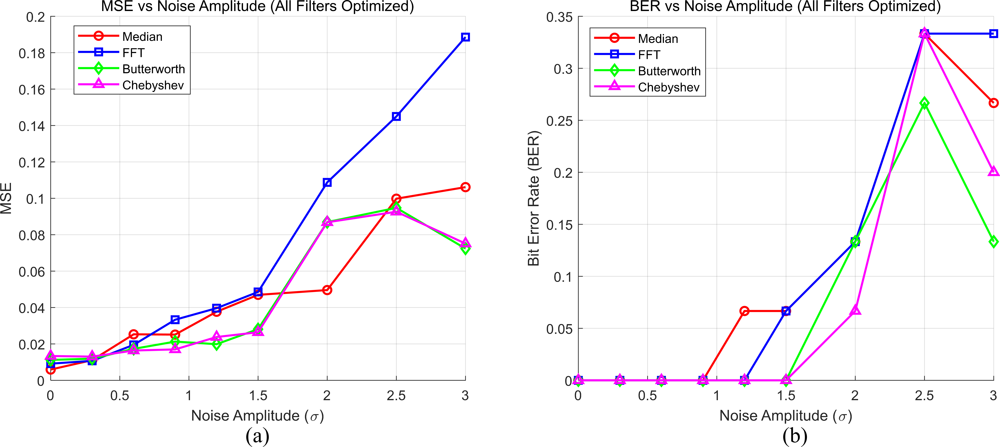
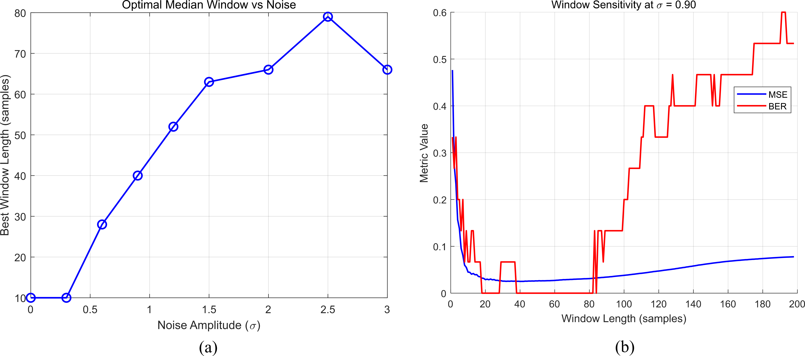

<!-- editor:section id="comm-system-model" kind="standard" hidden="false" -->
## System Model
<!-- editor:block id="comm-scope-config" type="paragraph" hidden="false" -->
Developed a reproducible MATLAB study linking thermal-noise calculations, distance-dependent attenuation and coherent on-off-keying demodulation with a controlled four-filter comparison under AWGN. At the model point nearest 290 K, the Shannon-model calculation gave approximately 2.835, 4.698 and 7.504 Gb/s for 0.5, 1 and 2 GHz respectively. These are idealised analytical outputs, not measured throughput.
<!-- editor:block id="comm-link-budget" type="paragraph" hidden="false" -->
Under the stated 2 dB/km attenuation model, SNR was 103.86 dB at 0 km and 63.86 dB at 20 km. This is a calculated link-budget result at fixed source settings, not a field measurement.
<!-- editor:section id="comm-filter-pipeline" kind="standard" hidden="false" -->
## Filter-Optimisation Pipeline
<!-- editor:block id="comm-deterministic-study" type="paragraph" hidden="false" -->
The deterministic simulation used `rng(24)`, a 15-bit sequence and nine noise-amplitude conditions. It compared moving-median, FFT-based, fourth-order Butterworth and fourth-order Chebyshev filtering, with centre-bit sampling against a fixed 0.25 threshold.
<!-- editor:block id="comm-selection-rules" type="paragraph" hidden="false" -->
Median-window ties at the minimum BER were broken by MSE; FFT and IIR searches retained the first minimum-BER candidate. Overall ranking used average BER first and average MSE only if the average-BER minimum was tied.
<!-- editor:section id="comm-results-interpretation" kind="standard" hidden="false" -->
## Results and Engineering Interpretation
<!-- editor:block id="comm-butterworth-result" type="paragraph" hidden="false" -->
For this deterministic 15-bit, nine-condition simulation, the Butterworth filter had reported average BER 0.0593 and average MSE 4.04 × 10^-2. This reported short-simulation aggregate is not a measured error rate or a universal filter ranking.
<!-- editor:block id="comm-resolution" type="paragraph" hidden="false" -->
BER resolution is 1/15 within one condition and 1/135 for the nine-condition average. Each condition has one fixed-seed realization, so the result does not establish confidence intervals or statistical generalisation.
<!-- editor:section id="comm-validation-limits" kind="standard" hidden="false" -->
## Validation and Limitations
<!-- editor:block id="comm-method-limits" type="paragraph" hidden="false" -->
Interpretation is limited by zero-phase filtfilt, known noise amplitude during tuning, a fixed threshold, and parameter tuning and evaluation on the same simulated signal. Excel and closed-form recalculations are implementation cross-checks, not independent predictive validation. The study supports no hardware, measurement, deployment or real-time-readiness claim.
<!-- editor:section id="comm-selected-evidence" kind="standard" hidden="false" -->
## Selected Technical Evidence
<!-- editor:block id="comm-evidence-summary" type="paragraph" hidden="false" -->
The strongest evidence is the reproducible parameter-selection logic and the explicit resolution and evaluation limits attached to the reported BER and MSE comparison.
<!-- editor:block id="commimgmse01" type="image" hidden="false" -->

Mean-squared error and bit-error rate across the four optimised filtering pipelines in the documented simulation.
<!-- editor:block id="commimgwin01" type="image" hidden="false" -->

Median-window selection and MSE/BER sensitivity across candidate window lengths in the documented simulation.
