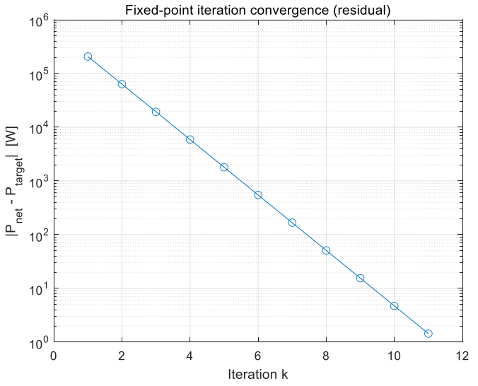
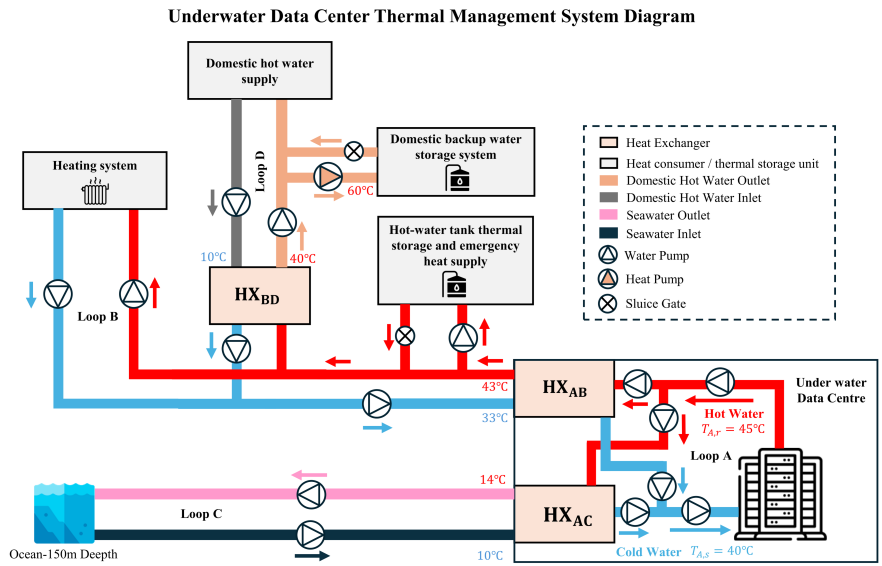

<!-- editor:section id="foh-design-context" kind="standard" hidden="false" -->
## Design Context
<!-- editor:block id="foh-design-overview" type="paragraph" hidden="false" -->
This team systems-design concept joined energy, communication and control, thermal management and an underwater data centre through shared electrical, thermal, information and safety interfaces. The report and integrated concept are team outputs.
<!-- editor:section id="foh-role-contribution" kind="contribution" hidden="false" -->
## My Role and Contribution
<!-- editor:block id="foh-role-summary" type="paragraph" hidden="false" -->
As group coordinator, I led the Energy System, Communication, Monitoring and Control Systems, and Underwater Data Centre workstreams. I also contributed to mission definition, site and operating requirements, and structural integration, with responsibility for aligning electrical, thermal, information and safety interfaces across the overall concept.
<!-- editor:section id="foh-technical-highlights" kind="standard" hidden="false" -->
## Technical Highlights
<!-- editor:block id="foh-energy-design" type="paragraph" hidden="false" -->
Under the report's assumed hydraulic-loss and auxiliary-load model, fixed-point sizing converged in 11 iterations to about 2.298 MW gross generation for a 1.500 MW net target, including about 0.729 MW pumping and 0.069 MW auxiliary demand. This is a concept-stage analytical result, not measured generation or achieved plant performance.
<!-- editor:block id="foh-microgrid-design" type="paragraph" hidden="false" -->
The concept uses a 6.6 kV dual-bus backbone with 690 V local distribution, redundant paths for a single credible fault, staged S0–S4 load shedding and reverse restoration. Fast transients are assigned to supercapacitors, bridging to LFP battery storage, and long-duration resilience to hydrogen storage and fuel cells; these are design allocations without validated response times.
<!-- editor:block id="foh-udc-design" type="paragraph" hidden="false" -->
The Underwater Data Centre uses a 250 kW IT design load and four hydraulically isolated, thermally coupled loops: a 40–45 °C technical loop, a 43/33 °C heat-recovery bus and a 10–14 °C seawater heat-rejection path. These are concept design values and model inputs, not measured operating temperatures.
<!-- editor:section id="foh-outcomes-limits" kind="standard" hidden="false" -->
## Outcomes and Limits
<!-- editor:block id="foh-fault-outcome" type="paragraph" hidden="false" -->
For selected single-credible-fault cases, the concept preserves up to 200 kW (80%) service through 1+1 pumps and heat exchangers, isolation and controlled derating. This is a requirement and analysis scenario, not a tested or guaranteed service level.
<!-- editor:block id="foh-safety-boundary" type="paragraph" hidden="false" -->
Safety-critical protection is assigned to deterministic local controllers and hardwired or safety-PLC interlocks; any optional AI capability is advisory only and cannot override safety actions. The work establishes a concept, not construction, deployment, certification or a single deployment-depth conclusion.
<!-- editor:section id="foh-selected-evidence" kind="standard" hidden="false" -->
## Selected Technical Evidence
<!-- editor:block id="foh-evidence-summary" type="paragraph" hidden="false" -->
The strongest engineering evidence is the convergence-based energy balance, explicit microgrid resilience logic and the thermally coupled data-centre architecture, each bounded to the team concept and its documented assumptions.
<!-- editor:block id="fohimgotec01" type="image" hidden="false" -->

Fixed-point convergence of the coupled gross-generation and parasitic-load calculation.
<!-- editor:block id="fohimgudc001" type="image" hidden="false" -->

Four hydraulically isolated but thermally coupled loops linking rack cooling, heat recovery and seawater rejection.
