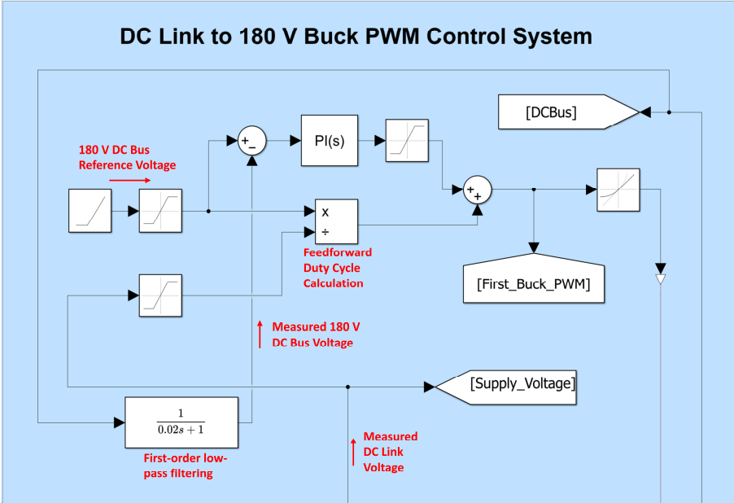
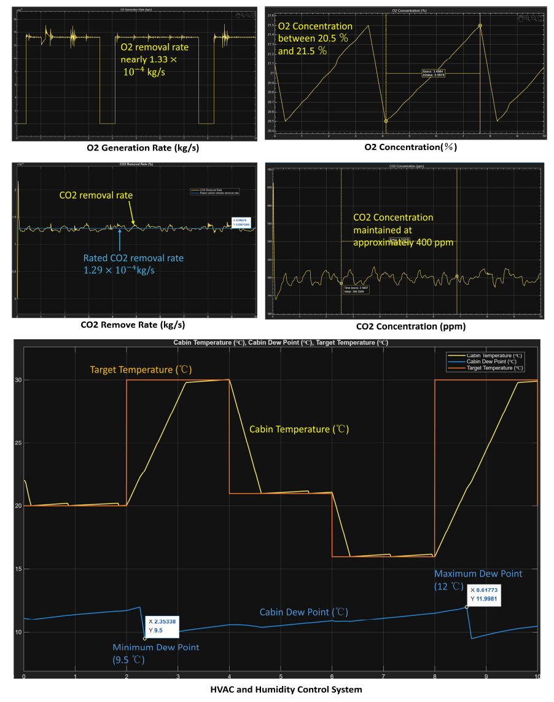

<!-- editor:section id="life-engineering-challenge" kind="standard" hidden="false" -->
## Engineering Challenge
<!-- editor:block id="life-opening-boundary" type="paragraph" hidden="false" -->
Life-support demand cannot be represented credibly as a bank of fixed resistors: pumps, electrolysis, ventilation and thermal management switch with water inventory and cabin conditions. This is an individual detailed design, model and report within the larger team habitat concept, not personal authorship of the whole habitat.
<!-- editor:section id="life-coupled-architecture" kind="standard" hidden="false" -->
## Coupled System Architecture
<!-- editor:block id="life-domain-coupling" type="paragraph" hidden="false" -->
The model couples electrical, rotational-mechanical, moist-air and thermal, gas-concentration and water-inventory behaviour. A disturbed 690 V three-phase source feeds a DC link and a regulated 180 V life-support bus. The conversion model includes current limiting, a pre-charge path, filtering, DC-link buffering and PWM-controlled buck conversion. Represented loads cover water intake, SWRO desalination, recovery and distribution, oxygen generation, carbon-dioxide removal, HVAC and humidity management; some are equivalent process loads rather than physical devices.
<!-- editor:section id="life-control-strategy" kind="standard" hidden="false" -->
## Control Strategy
<!-- editor:block id="life-control-layers" type="paragraph" hidden="false" -->
Supervisory feedback from oxygen, carbon-dioxide, water level, temperature and dew point produces enable signals and setpoints. The lower layer uses feedforward, PI correction, filtering and PWM to regulate the 180 V bus and actuator power. This is model control logic, not a real-time controller claim.
<!-- editor:block id="life-targets" type="paragraph" hidden="false" -->
Documented model targets are water inventory 600–1200 L, desalination about 1200 L/day, oxygen 20.5–21.5%, carbon dioxide near 400 ppm, cabin temperature 15–30 °C and dew point below 12 °C. They are targets, not experimental outcomes.
<!-- editor:section id="life-simulation-evidence" kind="standard" hidden="false" -->
## Simulation Evidence
<!-- editor:block id="life-bus-trace" type="paragraph" hidden="false" -->
Under the documented disturbance and load-switching sequence, the simulated 180 V bus remained close to its reference while DC-link voltage and current changed. The reported traces also cover motor speed, gas states, cabin temperature, dew point, water level and PWM signals; no exact ripple, settling-time or universal-stability claim is made.
<!-- editor:block id="life-energy-ratio" type="paragraph" hidden="false" -->
For the documented model configuration, the cumulative simulated input-output energy ratio is approximately 97.6%. This is a cumulative simulated input-output energy ratio, not measured physical-system or converter efficiency. Some average-value converter elements in the model use fixed idealised 100% efficiency settings. Instantaneous ratios can exceed unity when DC-link and buffer capacitors release stored energy; the report does not interpret this as physical efficiency above one.
<!-- editor:section id="life-model-limitations" kind="standard" hidden="false" -->
## Model Limitations and Next Steps
<!-- editor:block id="life-future-fidelity" type="paragraph" hidden="false" -->
The model retains rated-point device models and empirical gains. Higher-fidelity manufacturer maps, detailed SWRO and HVAC process models, thermal ports, ageing, fault modes and experimental validation remain future work; the present evidence does not establish hardware performance or validated digital-twin fidelity.
<!-- editor:section id="life-selected-evidence" kind="standard" hidden="false" -->
## Selected Technical Evidence
<!-- editor:block id="life-evidence-summary" type="paragraph" hidden="false" -->
The most informative evidence is the closed-loop coupling across power conversion and process states, together with the disturbance-sequence bus trace and the explicitly qualified cumulative energy accounting.
<!-- editor:block id="lifeimgbus01" type="image" hidden="false" -->

Feedforward and PI feedback control used to regulate the 180 V life-support bus.
<!-- editor:block id="lifeimgenv01" type="image" hidden="false" -->

Simulated oxygen, carbon-dioxide, cabin-temperature and dew-point regulation under the documented operating sequence.
